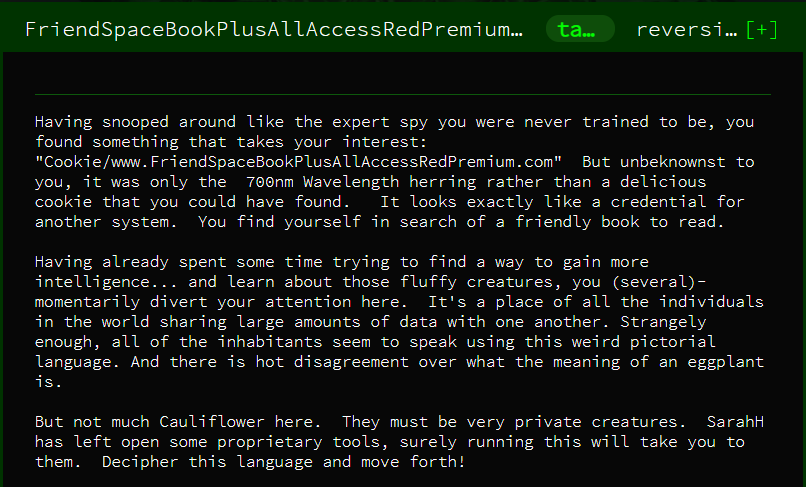

# FriendSpaceBookPlusAllAccessRedPremium

DISCLAIMER: This is my first CTF writeup and I'm very new to CTF games. Apologies if my terminology is poor.

The FriendSpaceBookPlusAllAccessRedPremium (FSBPAARP) challenge is one of the beginner challenges from the Google CTF 2019, however from various Twitter traffic it seemed to be one of the more difficult problems.

The FSBPAAR challenge comprises of two files:
* `vm.py`
* `program`

## VM.PY

The `vm.py` script emulates a simple stack-based VM which comprises of four key components:
1. The stack
2. The instruction pointer
3. Accumulator 1
4. Accumulator 2

For the purposes of reverse-engineering this program, the most important component is the stack. We'll get to this later.

## PROGRAM

The `program` file consists of an assembly program written entirely in emojis.

## Solving the challenge
The first step to solving the challenge was to see what we're working with. As such, I ran the program and you can see the output below:

The program starts off generating a URL but quickly grinds to a halt. Somehow, we're going to need to speed it up, or predict what the output is going to be.

My first attempt to reverse engineer the program was to decode the emojis using the `OPERATIONS` list in `vm.py`. I ended up with a file that looked like this:

This let me follow exactly what was happening in the VM, from the instruction pointer to the stack. However, after a couple of hours attempting to understand what was happening at the stack level with pen and paper, I remembered that this was a Python script, and that meant I could start printing out what the program was doing.

From the decoded version of the program I knew where the program was printing out each character of the URL. I put a print statement and ran it again.

