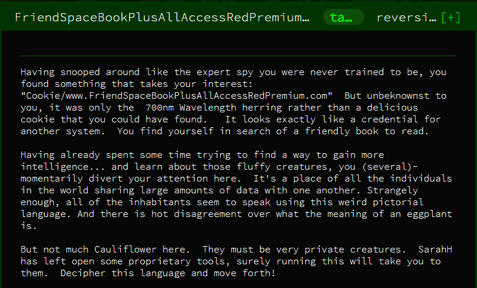
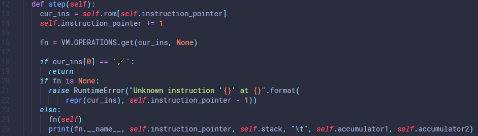

# FriendSpaceBookPlusAllAccessRedPremium



DISCLAIMER: This is my first CTF writeup and I'm very new to CTF games. Apologies if my terminology is poor. I also tried to write this in a way that is easy for other beginners to follow, including my thought process, so sorry if it's a bit verbose.

The FriendSpaceBookPlusAllAccessRedPremium (FSBPAARP) challenge is one of the beginner challenges from the Google CTF 2019 event, however from various Twitter traffic it seemed to be one of the more difficult problems.

The FSBPAAR challenge comprises of two files:
* `vm.py`
* `program`

## VM.PY


The `vm.py` script emulates a simple stack-based VM which comprises of three (four?) key components:
1. The [stack](https://en.wikipedia.org/wiki/Stack_register)
2. The [instruction pointer](https://en.wikipedia.org/wiki/X86_assembly_language#Using_the_instruction_pointer_register)
3. [Accumulators](https://en.wikipedia.org/wiki/Accumulator_(computing)) 1 and 2

## PROGRAM


The `program` file consists of an assembly program written entirely in emojis.

## SOLVING THE CHALLENGE
### INITIAL IMPRESSIONS
The first step to solving the challenge was to see what we're working with. As such, I ran the program and you can see the output below:


The program starts off generating a URL but quickly grinds to a halt. Somehow, we're going to need to speed it up, or calculate what the output is going to be.

### I CAN'T READ IN EMOJI
My first step to reverse engineering the program was to decode the emojis using the `OPERATIONS` list in `vm.py`. I ended up with a file that looked like this:


This let me follow exactly what was happening in the VM, from the instruction pointer to the stack. The program seemed to be split into four distinct sections: a section of numbers (character sets) loaded into the stack followed by an offset (more on this later), followed by some instructions (three sets) which were then followed by a section of other, different instructions (screenshot above). To visualise this:

```
# program
input character set 1
offset 1
instruction set 1

input character set 2
offset 2
instruction set 2

input character set 3
offset 3
instruction set 3

calculation instructions
```

I quickly worked out that the instructions after each of the character sets were identical, with the exception of the markers (first 5 characters of the first line), and the set of numbers at the end the first line.


I initially thought these numbers were some kind of random seed, but I was very wrong, as we'll find out. 

### BACK TO THE STONE AGE
My first attempt at deciphering the program involved pen and paper. After a couple of hours of trying to understand what was happening by drawing the stack on several pages, I remembered that this was a Python script, and that meant I could start printing out what the program was doing.

From the decoded version of the program I knew which function the program was using to print out each character of the URL. I added a print statement and ran it again.


In the screenshot above, I'm outputing five objects on each line. From left to right:
1. The character (e.g. "h")
2. The instruction pointer (e.g. 391)
3. The stack (e.g. "[0, 17488, 16758, 16599, 16285, 16094, 15505, 15417, 14832, 14450, 13893, 13926, 13437, 12833, 12741, 12533, 11504, 11342, 10503, 10550, 10319, 975, 1007, 892, 893, 660, 743, 267, 344, 264, 339, 208, 216, 242, 172, 74, 49, 119, 113, 119, 1, 104]")
4. The value in accumulator 1 (ACC1) (e.g. 2)
5. The value in accumulator 1 (ACC2) (e.g. 389)

I knew what each of the values I had in my screenshot were thanks to my pen and paper programming, but the key values are the ones stored in accumulator 1 (i.e. 2, 3, 5, 7, etc.). I knew that the last thing the program did before it printed out an actual character was to apply a binary XOR operation on the last two values on the stack, which meant I actually needed the output of just *before* the XOR operation (because it pops values off the stack). So I moved my print statement:


As you can see, the values we need are the last two in the stack, e.g. 106 and 2 in our first line. The binary XOR of these values is 104, hence the last value of each stack in our first stack screenshot.

### STEPPING STONES
Now that I had the values which were being used to calculate the output character, I wanted to know *exactly* what was happening at each step, so I decided to output the same information at each step in the processor.



The output is pretty unwieldy, but it does give me the information I need. The following screenshot is skipping to part way into our program, just after all of the values from the first load section are loaded into the stack.


I've highlighted a few things here. The red numbers indicate important lines, whilst the blue numbers mark important values.

To breakdown the highlighted sections:
1. This is the last line of the initial stack load (i.e. our encoded characters). Notice the `106` value (marked with a blue "1"), which will translate to "h" eventually.
2. This is the line just before the encoding value starts to be calculated. Notice that the `1` (marked with a blue "2") and `106` are swapped so that the `106` is higher in the stack. The `1` value is a counter, but also an offset (more detail on this later); I've also marked the curious `389` value with a blue "3". At this point we still don't know exactly what it's used for.
3. This is where the calculation ends. Note the `2` in accumulator 1.
4. This is where the `389` finally comes into play. This value is used as a pointer to tell the program where to jump to using the `jump_top` function. The final two lines are the program applying the binary XOR, storing the result (marked with a blue "4") and then printing it out.

This means that everything between sections 2 and 3 in the stack trace is the calculation to find the number used for decoding. An important discovery here is that the algorithm only uses the counter value to calculate the decoding number (i.e. it doesn't use the encoded character in the calculation). It turns out that I'm terrible at deriving the actual algorithm for this calculation, so I started looking at number patterns.

### PATTERN MATCHING
To recap what I know so far:
1. The first set of instructions in the emoji program loads encoded characters into the stack.
2. At the point of printing a character to stdout, the value in accumulator 1 was used to perform a binary XOR with the encoded input character.
3. I need to work out how the values in accumulator 1 are generated.

The numbers in accumulator 1 are as follows: `2, 3, 5, 7, 11, 101, 131, 151, 181, 191, 313, 353, 373, 383, 727, 757, 787, 797, 919, 929, 10301, 10501, 10601, 11311, 11411, 12421...`. For those of you who are more familiar with numbers sequences, you may have already picked up on the pattern. Unfortunately, I'm not, so apart from realising that the numbers (apart from the first 4) were palindromic, I was stumped. Eventually, I went out for lunch and had an epiphany: palindromic prime numbers. I quickly Googled a list of prime numbers and confirmed my hunch was correct.

### DECODING THE URL
From here on it's pretty straightforward. I wrote a Python script to apply a binary XOR to the encoded input values, using palindromic prime numbers.

My first pass at the script was a *very* rudimentary protopype, but it worked:

```python
# decoder.py
def is_prime(num):
    if num > 1:
        for i in range(2,num):
            if (num % i) == 0:
                return False
        else:
            return True
    else:
        return False

def is_palindrome(num):
    if str(num) == str(num)[::-1]:
        return True
    else:
        return False

initial_num = 2
num = initial_num
i = 0
# in_val is just a list of encoded input numbers
while i < len(in_val):

    found = False
    while not found:
        if is_prime(num):
            if is_palindrome(num):
                chr_val = in_val[i]^num
                print("\tin:", in_val[i], "\tkey:", num, "\tchr:", chr_val, "\tout:", chr(chr_val))
                found = True
        num += 1
    i += 1
```

Which output:
```
# decoder.py output
in: 106         key: 2          chr: 104        out: h
in: 119         key: 3          chr: 116        out: t
in: 113         key: 5          chr: 116        out: t
in: 119         key: 7          chr: 112        out: p
in: 49          key: 11         chr: 58         out: :
in: 74          key: 101        chr: 47         out: /
in: 172         key: 131        chr: 47         out: /
in: 242         key: 151        chr: 101        out: e
in: 216         key: 181        chr: 109        out: m
in: 208         key: 191        chr: 111        out: o
in: 339         key: 313        chr: 106        out: j
in: 264         key: 353        chr: 105        out: i
in: 344         key: 373        chr: 45         out: -
in: 267         key: 383        chr: 116        out: t
in: 743         key: 727        chr: 48         out: 0
in: 660         key: 757        chr: 97         out: a
in: 893         key: 787        chr: 110        out: n
in: 892         key: 797        chr: 97         out: a
in: 1007        key: 919        chr: 120        out: x
in: 975         key: 929        chr: 110        out: n
in: 10319       key: 10301      chr: 114        out: r
in: 10550       key: 10501      chr: 51         out: 3
in: 10504       key: 10601      chr: 97         out: a
in: 11342       key: 11311      chr: 97         out: a
in: 11503       key: 11411      chr: 124        out: |
in: 12533       key: 12421      chr: 112        out: p
in: 12741       key: 12721      chr: 116        out: t
in: 12833       key: 12821      chr: 52         out: 4
in: 13437       key: 13331      chr: 110        out: n
in: 13926       key: 13831      chr: 97         out: a
in: 13893       key: 13931      chr: 46         out: .
in: 14450       key: 14341      chr: 119        out: w
in: 14832       key: 14741      chr: 101        out: e
in: 15417       key: 15451      chr: 98         out: b
in: 15505       key: 15551      chr: 46         out: .
in: 16094       key: 16061      chr: 99         out: c
in: 16285       key: 16361      chr: 116        out: t
in: 16599       key: 16561      chr: 102        out: f
in: 16758       key: 16661      chr: 99         out: c
in: 17488       key: 17471      chr: 111        out: o
```

This script iterated through integers, checking whether they were a palindromic prime, then applying a binary XOR if they were. Unfortunately, this iteration of the script had two big problems:
1. It was slow. Iterating over individual integers is not an efficient method.
2. I had no way to offset the starting palindromic prime. Remember the `1` value from earlier (marked with a blue "2")?

After a quick Google, I found the following website on [palindromic primes](http://mathworld.wolfram.com/PalindromicPrime.html), where I noticed a familiar sequence, labelled [A002385](http://oeis.org/A002385). On this second page I found a handy snippet for generating a list of primes in Python:

```python
from itertools import chain

from sympy import isprime

A002385 = sorted((n for n in chain((int(str(x)+str(x)[::-1]) for x in range(1, 10**5)), (int(str(x)+str(x)[-2::-1]) for x in range(1, 10**5))) if isprime(n))) # Chai Wah Wu, Aug 16 2014
```

I used this snippet to rewrite my code and because the primes were stored in a list, it was very easy to add an offset.

```python
# decoder.py
A002385 = sorted((n for n in chain((int(str(x)+str(x)[::-1]) for x in range(1, 10**5)), (int(str(x)+str(x)[-2::-1]) for x in range(1, 10**5))) if isprime(n))) # Chai Wah Wu, Aug 16 2014

offset = 765 - 1
initial_num = A002385[offset]

i = 0
for val in in_val3:
    chr_val = in_val3[i]^A002385[offset]
    print("in:", in_val3[i], "\tkey:", A002385[offset], "\tchr:", chr_val, "\tout:", chr(chr_val))

    i += 1
    offset += 1
```

I ran this over my three lists, manually changing the input list (`in_val`, `in_val2`, and `in_val3`). This resulted in URL: [http://emoji-t0anaxnr3nacpt4na.web.ctfcompetition.com/humans_and_cauliflowers_network/](http://emoji-t0anaxnr3nacpt4na.web.ctfcompetition.com/humans_and_cauliflowers_network/).

The code I wrote (`convert.py` and `decoder.py`) and raw outputs (`output.txt` and `decoded url.txt`) are available in this the `artefacts` folder in this repo.
